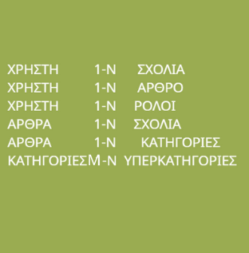

## 🔁 About us 🔁
L00perz is a group consisting of 3 college students and friends that attend at IEK AKMI. The group was created with the soul purpose of creating projects/assignments like this. We try our best to make our projects as simple as possible, so even someone with little experience can understand and comprehent our projects.

# IN REGARDS TO THE ASSIGNMENT

As part of our studies in the university of IEK AKMI, we were assigned to draw a relational database about a fashion blogger. The requirements are: There are users who can access the management environment and everyone has a role, and everyone can write articles. Articles belong to a category and categories can belong to one or more super-categories. In each article readers can write comments but they don't need to login to the application in order to make comments.

## ANALYZING THE DIAGRAM

- TABLE OF RELATIONS

First and foremost we started with the table of relations. 
Each column of the table represents a relationship between the data  given to us from the exercise. We managed to detect six of them as shown in the diagram below.

- THE DIAGRAM

Studying the correlations from the table we created, we designed a diagram to represent these correlations in greater detail. We changed the color for the relations, entities and keys so as to make it more visually appealing and easier for everybody to read and comprehend. The non-coloured box represents the entities themselves, the cyan rombus represents the noun that connects the two entities, and the red boxes the primary keys of the "one" entities. While the darker blue box represents the table resulting from the connection of of Many to Many relation (N:M).

- EXPLANATION OF RELATIONS

USER - (1-N) - COMMENTS : One user can make many comments , but many comments can be made from one user.

USER - (1-N) - ARCTICLE : One user can write many arcticles , but many arcticles can be made from one user.

USER - (1-N) - ROLES : One user can have many roles , but many arcticles can be made from one user.

ARCTICLE - (1-N) - COMMENTS : One arcticle can have many comments , but many comments belong to one arcticle.

ARCTICLE - (1-N) - CATEGORIES : One arcticle can belong to many categories , but many categories belong to one arcticle.

CATEGORIES - (N:M) - SUPERCATEGORIES : Many categories belong to their supercategories, but many supercategories belong to their categories.

*The primary key is derived from the (1) entities, and placed in the (M) entities, so as to create the relation.*

With this flow of thought we managed to create the diagram below.

## Authors

             ********************  L00PERZ ********************

- [@gkojcko](https://github.com/gkojcko)

- [@PanagisVr](https://github.com/PanagisVr)

- [@dharampreetc](https://github.com/dharampreetc)

WE APPREICIATE YOUR TIME.

