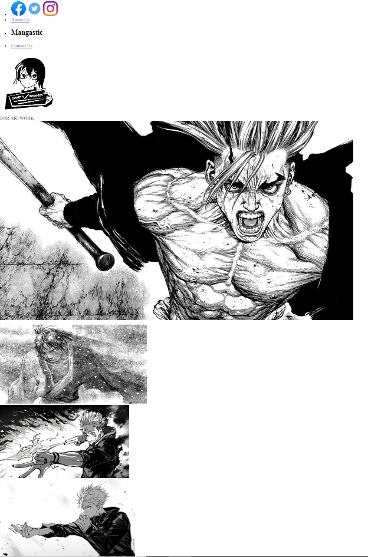
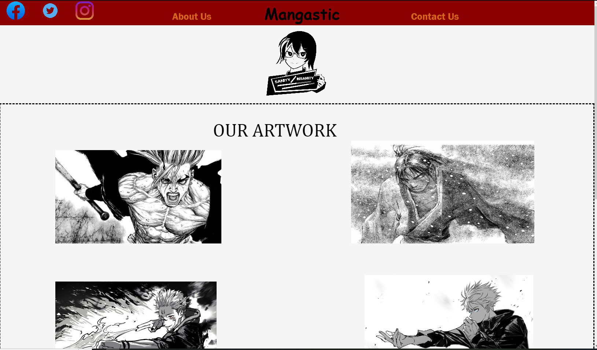
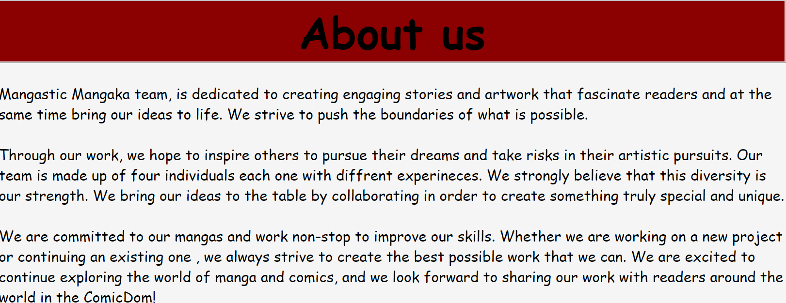
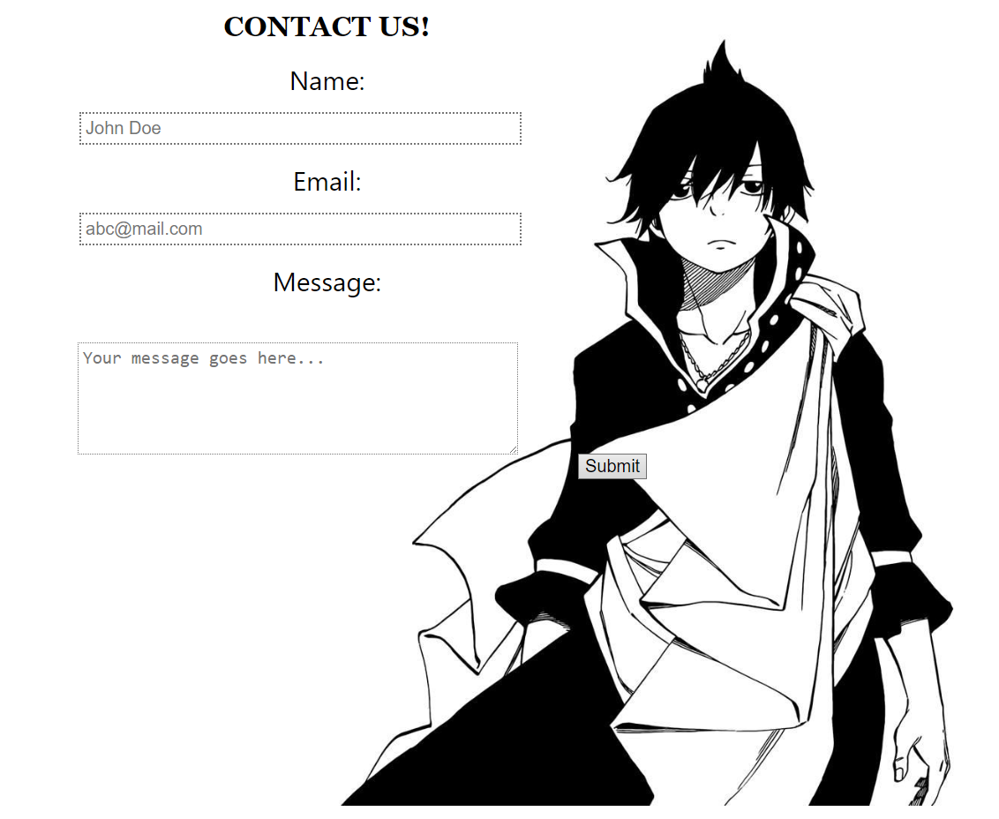

## 🔁 About us 🔁
L00perz is a group consisting of 3 college students and friends that attend at IEK AKMI. The group was created with the soul purpose of creating projects/assignments like this. We try our best to make our projects as simple as possible, so even someone with little experience can understand and comprehent our projects.

# IN REGARDS TO THE ASSIGNMENT

As part of our studies in the university of IEK AKMI, we were assigned a project to create our own website. The context says that we are are a Mangakaka developer team that would like to take part in this year ComicDom, however in order to do so , we need to have our own website showcasing our work. Our website must consist of a logo , a title, a menu and some information about our team and a secondary page containing the contact form. The website must be created in HTML and styled with CSS.
## BREAKING THE CODE INTO SECTIONS

- THE HTML CODE

The first thing we did, is write the HTML code. In other words the foundations of our webpage. In the HTML code we included the website title , our pictures and the paragraphs containing our mangaka team  information. Then we carefully splitted all the code into divisions (
 tag), so as to make the HTML code more managable by the CSS code. HTML  is the foundation of our site, and without the CSS code it would look something like this:

CSS would later be added in order to make some vital visual adjustments.

 
- THE CSS CODE
 
After writing the HTML code , it was time to make some visual adjustments. Thanks to CSS, the website got it's own identity, colours and style! But everything comes with a price. In the early stages of the development we thought that HTML would be the tricky part, if only we knew what was about to happen in the CSS part. We spent hours and hours trying to adjust the elements in the right place of the site, but moving an element would cause something else move with it as well, and so on. However after hours of trying and hours of adjustments we managed to create our Mangkaka Website, and now we can take part in the ComicDom.
 
 

- THINGS WE ARE PROUD OF 

1. THE SOCIAL MEDIA BUTTONS
2. THE ABOUT US BUTTON : We really like the fact that when the button is clicked , the user gets redirected down to the site, where the about section is located at.
3. THE CONTACT FORM

## Authors

             ********************  L00PERZ ********************

- [@gkojcko](https://github.com/gkojcko)

- [@PanagisVr](https://github.com/PanagisVr)

- [@dharampreetc](https://github.com/dharampreetc)

WE APPREICIATE YOUR TIME.

